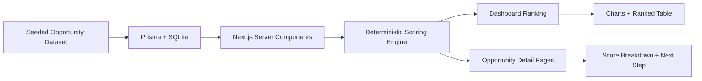

# automation-opportunity-scorer

A focused internal-tool style application that ranks recurring operational work and answers one question well: what should we automate next?


## Why this project matters

Automation programs often jump straight into building workflows without a clear prioritization model. This project demonstrates a more valuable upstream skill: analyzing recurring operational work, estimating ROI, and identifying which categories are worth automating first.

The portfolio story is straightforward:

> I can analyze real operational patterns, estimate automation ROI, and build tools that help organizations prioritize automation work.

## Key features

- Seeded MSP and service-operations dataset modeled as recurring categories, not raw ticket ingestion.
- Deterministic scoring engine with visible weights, assumptions, and ROI formulas.
- Dashboard with top candidates, quick wins vs higher-effort opportunities, charts, and a ranked table.
- Opportunity detail pages with score breakdowns, concrete implementation next steps, and risk notes.
- Local-first setup using Next.js, TypeScript, Tailwind CSS, Prisma, and SQLite.

## How this differs from an automation platform

This repo is intentionally not a workflow runner, chatbot, ticketing system, or orchestration layer.

- It does not ingest tickets, execute automations, or simulate approvals.
- It does not let users configure the scoring model from the UI.
- It does focus on prioritization logic, implementation fit, and visible ROI assumptions.

The output is a decision-support tool for operations leaders and automation engineers, not an execution engine.

## Architecture overview



More detail: [docs/architecture-diagram.md](./docs/architecture-diagram.md)

## Scoring methodology summary

The opportunity score is a weighted 100-point model using:

- monthly volume
- analyst time load
- repeatability
- standardization
- rework pressure
- SLA risk
- customer impact
- implementation ease
- approval ease

Savings are estimated with a simple visible formula:

```text
monthly_minutes_saved = monthly_volume * avg_handle_time_minutes * estimated_automation_rate
annual_cost_savings = annual_hours_saved * hourly_rate
```

Current hourly-rate assumption in code: `$48/hr`

Full methodology: [docs/scoring-methodology.md](./docs/scoring-methodology.md)

## Demo walkthrough

1. Open the dashboard to review the seeded portfolio of recurring operational categories.
2. Use the filters to isolate a team, automation pattern, or quick-win lens.
3. Review the top candidates and compare quick wins against higher-effort bets on the score-vs-effort chart.
4. Scan the ranked table to compare opportunity score, estimated hours saved, and annual savings.
5. Open an opportunity detail page to inspect the factor-by-factor score breakdown, ROI assumptions, suggested automation approach, and the recommended next implementation step.

## Local setup

The repo includes a seeded SQLite database at `prisma/dev.db`, so after install you can usually start the app immediately.

```bash
npm install
npm run dev
```

Open `http://localhost:3000`

To recreate the local database and reseed it:

```bash
npm run db:push
npm run db:seed
```

Other useful commands:

```bash
npm run lint
npm run build
```

## Docs

- [docs/project-overview.md](./docs/project-overview.md)
- [docs/scoring-methodology.md](./docs/scoring-methodology.md)
- [docs/engineering-decisions.md](./docs/engineering-decisions.md)
- [docs/architecture-diagram.md](./docs/architecture-diagram.md)
- [docs/resume-bullets.md](./docs/resume-bullets.md)
- [docs/screenshots/README.md](./docs/screenshots/README.md)

## Roadmap

Future ideas that are intentionally out of scope for v1:

- CSV upload or raw ticket ingestion
- authentication and multi-tenant logic
- configurable scoring UI
- executive export package
- trend forecasting over time
- approval simulation
- workflow execution or orchestration
