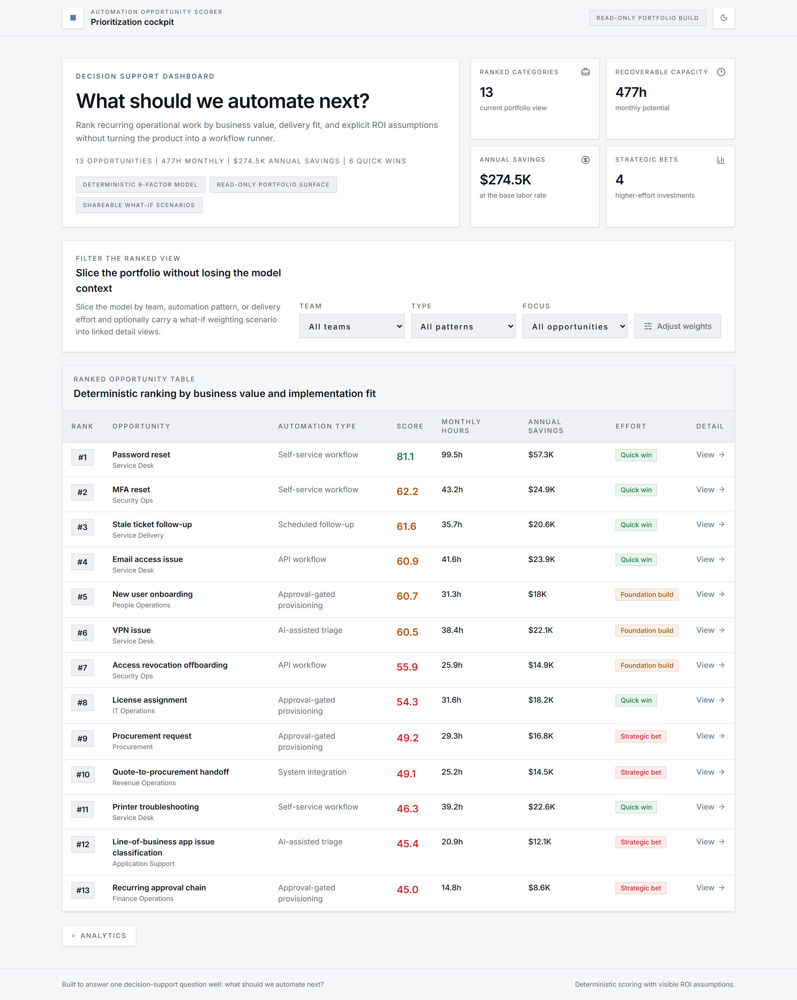
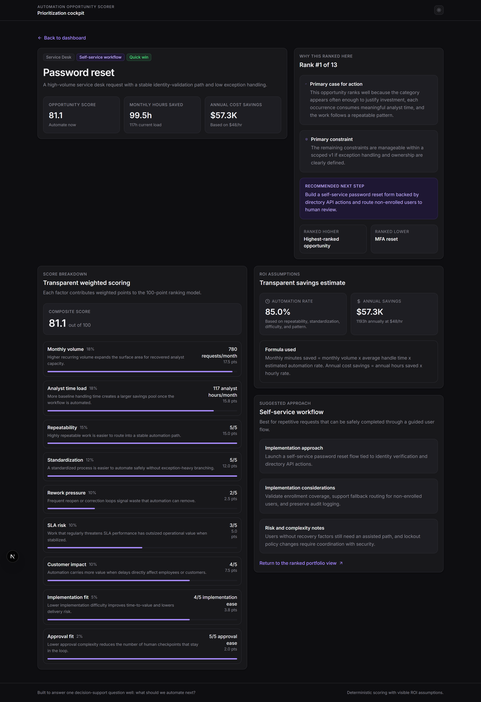
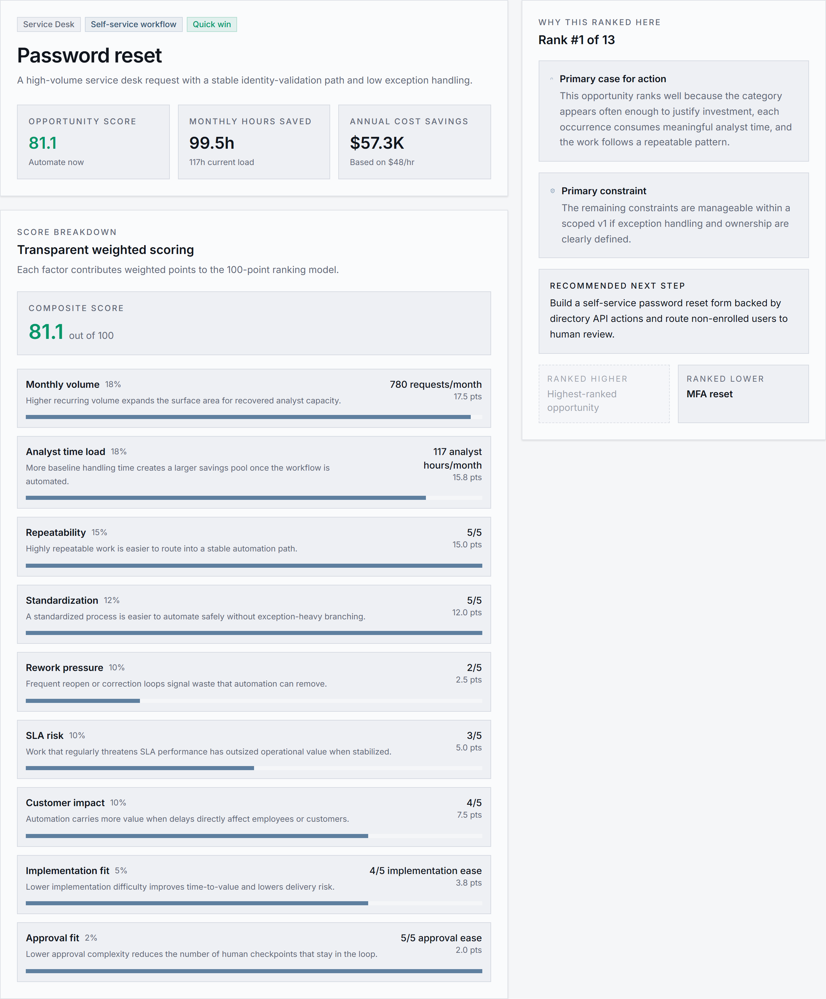
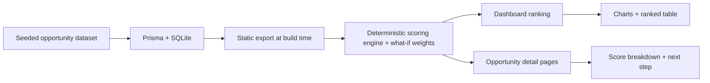

# automation-opportunity-scorer

Focused internal-tool style application that ranks recurring operational work and answers one question well: what should we automate next?





Demo target: [GitHub Pages](https://branqon.github.io/automation-opportunity-scorer/)
This URL is the configured deployment target for pushes to `main`.

## Why this project matters

Automation programs often jump straight into building workflows without a clear prioritization model. This project demonstrates the upstream skill that matters first: identifying recurring operational work, estimating ROI, and deciding where automation investment should go next.

The portfolio story is simple:

> I can analyze real operational patterns, estimate automation ROI, and build tools that help organizations prioritize automation work.

## Key features

- Seeded MSP and service-operations dataset modeled as recurring categories, not raw ticket ingestion.
- Deterministic 9-factor scoring model with visible weights and ROI assumptions.
- Dashboard with top candidates, quick wins vs strategic bets, charts, and a ranked table.
- Opportunity detail pages with score breakdowns, implementation considerations, risk notes, and concrete next steps.
- Interactive what-if weight slider for exploring how different factor priorities change the ranking.
- Statically exported and deployed to GitHub Pages with no runtime server required.
- Read-only portfolio surface designed for screenshots, demos, and interview walkthroughs.

## How this differs from an automation platform

This repo is intentionally not a workflow runner, chatbot, ticketing system, or orchestration layer.

- It does not ingest raw tickets.
- It does not execute automations.
- It does not simulate approvals.
- It does not provide saved scoring policies, admin-managed model changes, or workflow execution.

It is a prioritization product, not an execution product. The dashboard includes a what-if weight slider for exploratory analysis, but the base scoring model remains fixed and auditable in code.

## Architecture overview



More detail: [docs/architecture-diagram.md](./docs/architecture-diagram.md)

## Scoring methodology summary

Each opportunity is scored against 9 weighted factors:

- monthly volume
- analyst time load
- repeatability
- standardization
- rework pressure
- SLA risk
- customer impact
- implementation ease
- approval ease

Savings use a visible ROI model in code:

```text
monthly_minutes_saved = monthly_volume * avg_handle_time_minutes * estimated_automation_rate
annual_cost_savings = annual_hours_saved * hourly_rate
```

Current hourly-rate assumption: `$48/hr`

Full methodology: [docs/scoring-methodology.md](./docs/scoring-methodology.md)

## Demo walkthrough

1. Open the dashboard to review the seeded portfolio of recurring operational categories.
2. Filter by team, automation pattern, or focus area.
3. Open the what-if weight slider to explore how different factor priorities change the ranking.
4. Review top candidates and the quick-win vs higher-effort chart.
5. Review ranked opportunities by score, hours saved, and annual savings.
6. Open a detail page to inspect the score breakdown, ROI assumptions, and recommended next step.

## Local setup

This repo ships with a seeded local SQLite file and generated Prisma client, so no separate database bootstrap is required for the default path. `npm run build` exports a static site, so deployment does not require a runtime database.

```bash
npm install
npm run dev
```

Open `http://localhost:3000`

If you want to refresh the seeded dataset locally:

```bash
npm run db:reset
```

These Prisma commands use `npx` on demand rather than a pinned local Prisma CLI dependency.

If you remove `prisma/dev.db` and want to recreate it without starting the app:

```bash
npm run db:ensure
```

Optional environment override:

```bash
DATABASE_URL="file:./prisma/dev.db"
```

Useful commands:

```bash
npm run test
npm run test:e2e
npm run lint
npm run build
```

## Docs

- [docs/project-overview.md](./docs/project-overview.md)
- [docs/scoring-methodology.md](./docs/scoring-methodology.md)
- [docs/engineering-decisions.md](./docs/engineering-decisions.md)
- [docs/architecture-diagram.md](./docs/architecture-diagram.md)
- [docs/resume-bullets.md](./docs/resume-bullets.md)
- [docs/screenshots/README.md](./docs/screenshots/README.md)

## Roadmap

Reasonable future extensions after v1:

- historical trend views
- confidence notes by opportunity
- exportable stakeholder snapshots
- authenticated data management
- source-system ingestion for categorized operational data
