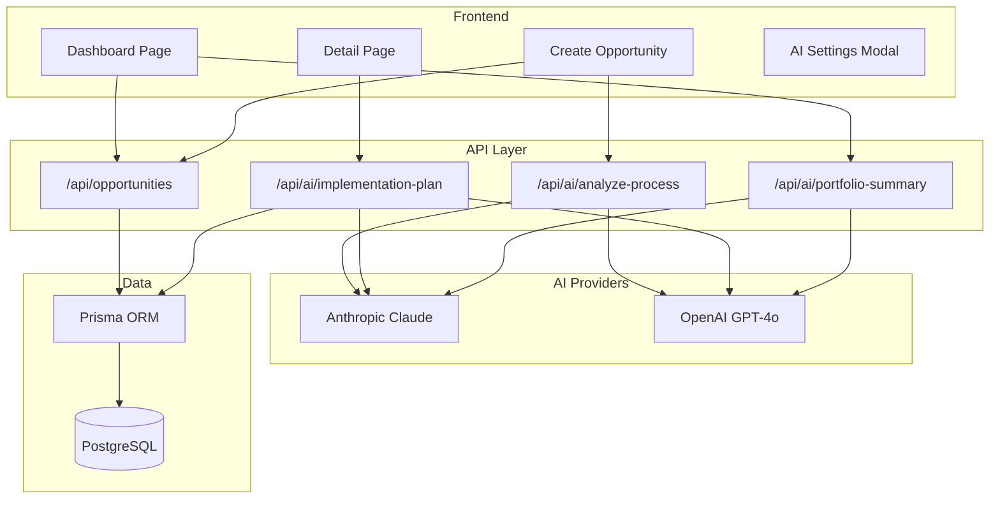

# Automation Opportunity Scorer


AI-powered tool that ranks operational automation opportunities by business value, implementation fit, and transparent ROI assumptions.


## Features

- **9-factor weighted scoring model** with transparent weights
- **AI-powered process intake** — paste a description, AI extracts scoring fields
- **AI implementation plans** per opportunity
- **AI portfolio insights** and roadmap generation
- **Configurable LLM providers** (Claude + OpenAI, BYOK)
- **Interactive dashboard** with filters, charts, and ranked table
- **Side-by-side opportunity comparison**
- **CSV export** of ranked opportunities
- **Dark mode** with system preference detection
- **Responsive design** — mobile cards + desktop table

## Architecture



## How the Scoring Model Works

Each opportunity is evaluated against **9 weighted factors** that produce a deterministic 100-point score:

| Factor | Weight |
|--------|--------|
| Monthly volume | 18% |
| Analyst time load | 18% |
| Repeatability | 15% |
| Standardization | 12% |
| Rework pressure | 10% |
| SLA risk | 10% |
| Customer impact | 10% |
| Implementation ease | 5% |
| Approval ease | 2% |

The scoring model is **deterministic and fixed in code** — AI augments the intake and planning stages but never replaces the scoring itself.

Each opportunity is categorized by:
- **Effort tier**: Quick win / Foundation build / Strategic bet
- **Value band**: Automate now / Validate next / Monitor

## AI Features

This project uses a **BYOK (Bring Your Own Key)** pattern for AI capabilities:

- Users configure their API keys in the browser settings modal
- Keys are stored in the browser only and **never touch server storage**
- Both Anthropic Claude and OpenAI GPT-4o are supported as providers

Three AI capabilities are available:

1. **Intake analysis** — paste a process description and the AI extracts structured scoring fields
2. **Implementation plans** — generate a detailed implementation plan for any opportunity
3. **Portfolio insights** — AI analyzes the full portfolio to surface themes, quick wins, and a recommended roadmap

## Getting Started

### Local Development

```bash
git clone <repo-url>
cd automation-opportunity-scorer
npm install

# Set up PostgreSQL and add DATABASE_URL to .env
npx prisma generate
npx prisma db push
npx prisma db seed
npm run dev
```

Open [http://localhost:3000](http://localhost:3000)

### Docker

```bash
docker-compose up
# Then seed:
docker-compose exec app npx prisma db push && docker-compose exec app npx prisma db seed
```

### Vercel

1. Connect this repo to [Vercel](https://vercel.com)
2. Add `DATABASE_URL` as an environment variable ([Neon Postgres](https://neon.tech) recommended)
3. Deploy

## Tech Stack

| Category | Technology |
|----------|------------|
| Framework | Next.js 16 (App Router) |
| Language | TypeScript 5 (strict mode) |
| Database | PostgreSQL via Prisma 7 |
| AI | Anthropic Claude + OpenAI GPT-4o |
| Styling | Tailwind CSS 4 |
| Charts | Recharts |
| Testing | Vitest |
| CI/CD | GitHub Actions |
| Deployment | Vercel + Docker |

## Project Structure

```
src/
├── app/
│   ├── api/
│   │   ├── ai/
│   │   │   ├── analyze-process/     # AI intake analysis
│   │   │   ├── implementation-plan/  # AI implementation plans
│   │   │   └── portfolio-summary/   # AI portfolio insights
│   │   └── opportunities/           # CRUD routes
│   ├── opportunities/
│   │   ├── [slug]/                  # Detail page
│   │   └── new/                     # Create page
│   ├── layout.tsx
│   └── page.tsx                     # Dashboard
├── components/
│   ├── charts/                      # Recharts visualizations
│   ├── dashboard/                   # Dashboard widgets
│   ├── detail/                      # Detail page components
│   ├── opportunities/               # Opportunity cards and tables
│   ├── providers/                   # React context providers
│   └── ui/                          # Shared UI primitives
├── lib/
│   ├── __tests__/                   # Vitest unit tests
│   ├── ai-prompts.ts               # Prompt templates
│   ├── llm.ts                      # LLM abstraction layer
│   ├── scoring.ts                  # Deterministic scoring engine
│   └── prisma.ts                   # Database client
prisma/
├── schema.prisma                    # Database schema
└── seed.ts                          # Seed data
```

## License

MIT
