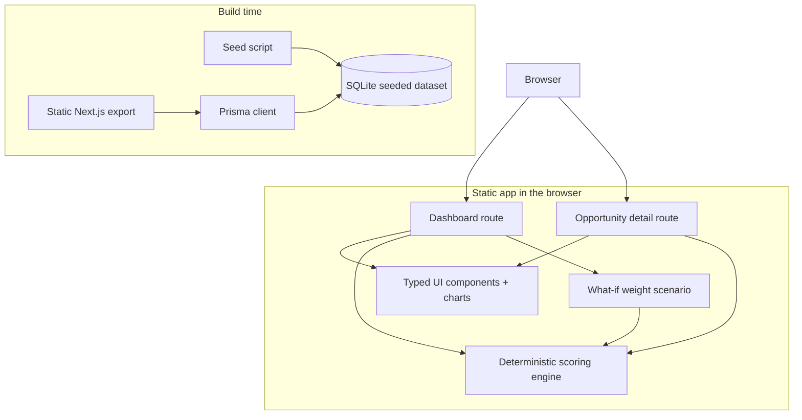

# Architecture Diagram

## Notes

- Prisma and SQLite are used at build time to produce the static export.
- The browser consumes a static app and runs dashboard/detail scoring against the seeded data payload.
- What-if weights are client-side only and travel through the URL so linked detail pages stay aligned with the dashboard scenario.
