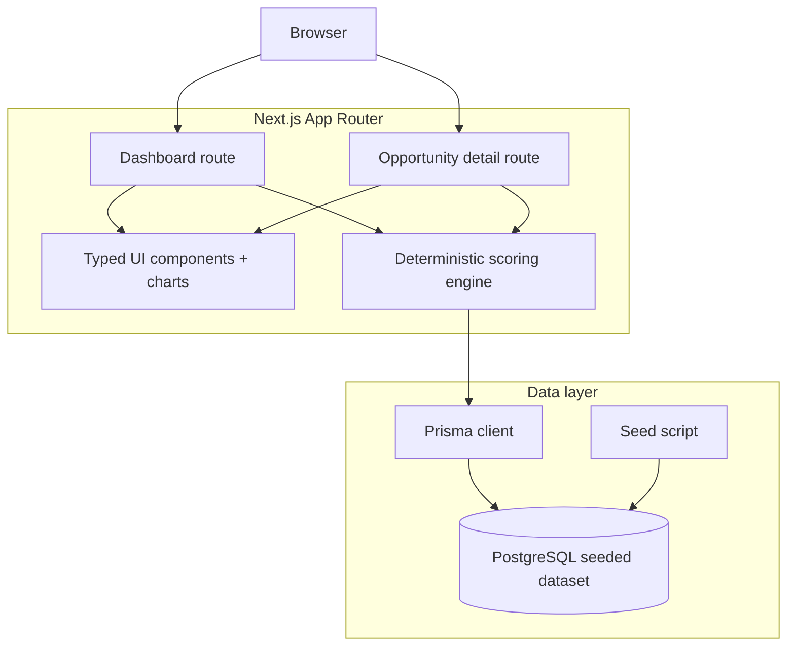

# Architecture Diagram

## Notes

- The browser only consumes rendered analytics views.
- The scoring engine runs on the server and transforms seeded opportunity records into ranked portfolio outputs.
- Prisma provides the typed boundary between the app and the PostgreSQL database.
